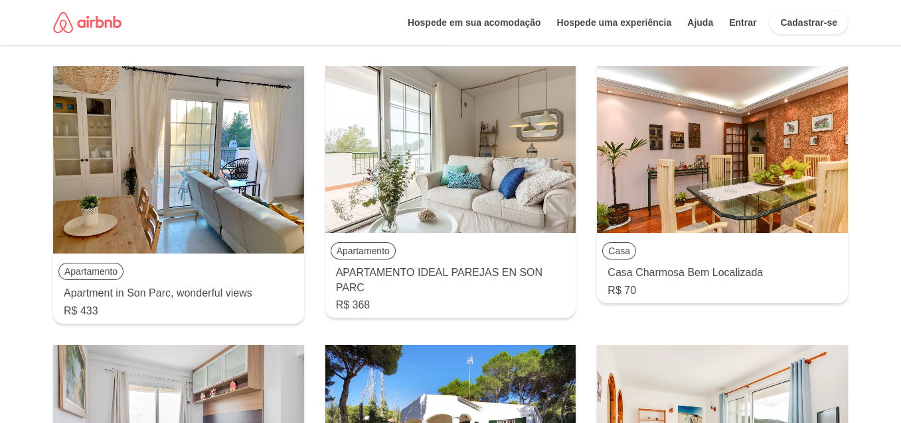

# Desafio Airbnb - Gama Academy

## Descrição

O seu desafio é criar uma página similar a do [Airbnb](https://www.airbnb.com.br/) através do consumo da API de quartos, usando Javascript Vanilla e Flexbox para organizá-los em cards na tela, a partir [deste banco de dados aqui](https://api.sheety.co/30b6e400-9023-4a15-8e6c-16aa4e3b1e72).

Resultados esperados
Tela com cards contendo:

- Imagem
- Tipo de propriedade
- Preço
